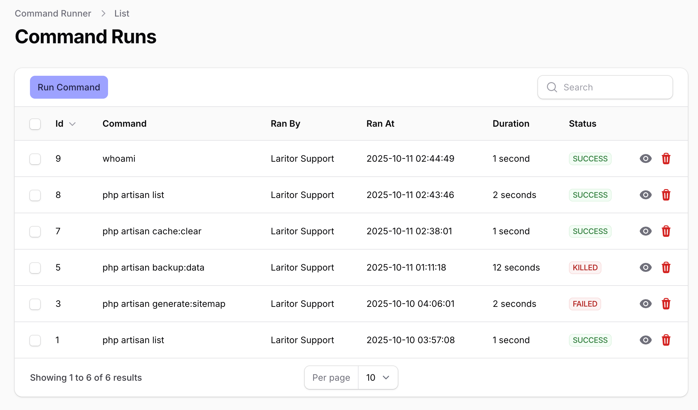
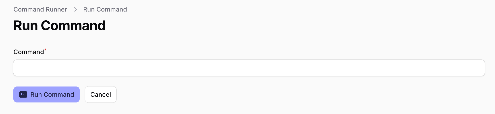
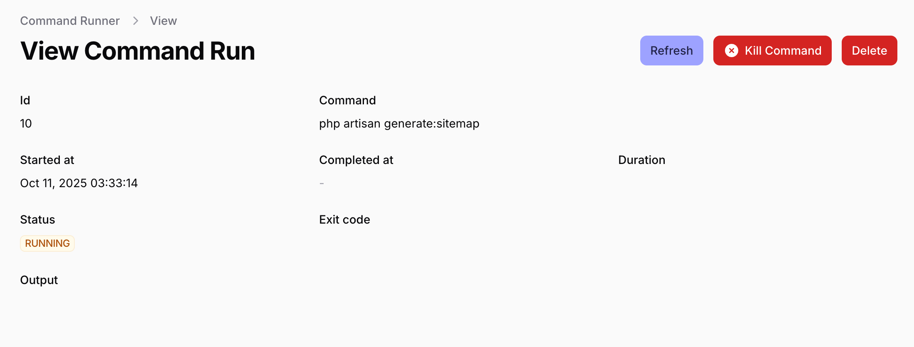
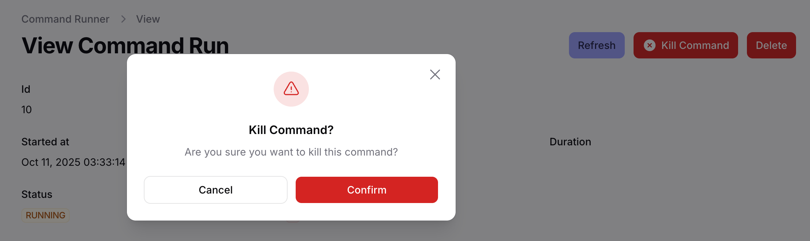
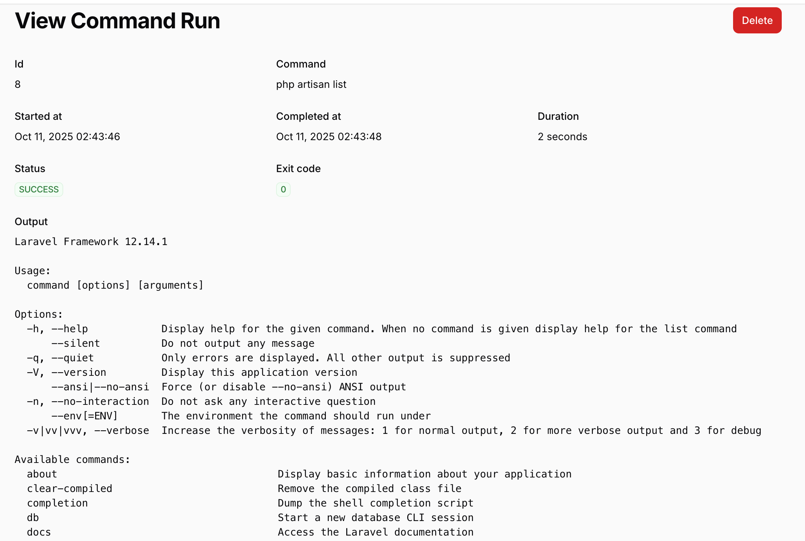

# filament-command-runner

**Run artisan and shell commands in the background from your Filament admin panel.**

[](https://packagist.org/packages/binarybuilds/filament-command-runner)
[](https://github.com/binarybuilds/filament-command-runner/actions?query=workflow%3Arun-tests+branch%3Amain)
[](https://github.com/binarybuilds/filament-command-runner/actions?query=workflow%3A"Fix+PHP+code+styling"+branch%3Amain)
[](https://packagist.org/packages/binarybuilds/filament-command-runner)

## Overview

`filament-command-runner` is a [Filament](https://filamentphp.com) plugin that allows users to run artisan and shell commands directly from the Filament admin panel. All commands are executed in the background so users don't have to wait for them to finish. They can return later to view the output or optionally terminate a running command midway.

The plugin also keeps a detailed history of past runs including:
- Command executed
- User who initiated the run
- Start time
- Duration
- Exit code
- Command output

## Screenshots






## Installation

You can install the plugin via composer:

```bash
composer require binarybuilds/filament-command-runner
```

## Usage

Register the plugin in your Filament panel service provider:

```php
use BinaryBuilds\CommandRunner\CommandRunnerPlugin;

$panel->plugin(CommandRunnerPlugin::make());

```

## Customizations
1. Command Validation

You can define custom validation logic using the validateCommand() method. This is useful for restricting which commands can be run:
```php
use Illuminate\Support\Str;

$panel->plugin(
    CommandRunnerPlugin::make()->validateCommand(function (string $attribute, string $value, \Closure $fail) {
        if (!Str::startsWith($value, 'php artisan')) {
            $fail("You can only run artisan commands");
        }
    })
);
```

2. Delete Command History

Control who can delete command history entries using a boolean or closure with `canDeleteCommandHistory()`:
```php
$panel->plugin(
    CommandRunnerPlugin::make()->canDeleteCommandHistory(fn ($user) => $user->isAdmin())
);
```

3. Purge Old Command History

Schedule the following artisan command to purge command history entries daily:

```bash
php artisan command-runner:purge-history
```
By default, it removes command runs older than **30 days**. You can specify a custom duration like this:
```bash
php artisan command-runner:purge-history 7
```
This example will purge command runs older than **7 days**.

## Testing

```bash
composer test
```

## Changelog

Please see [CHANGELOG](CHANGELOG.md) for more information on what has changed recently.

## Contributing

Please see [CONTRIBUTING](.github/CONTRIBUTING.md) for details.

## Security Vulnerabilities

Please review [our security policy](../../security/policy) on how to report security vulnerabilities.

## Credits

- [Srinath Reddy Dudi](https://github.com/srinathreddydudi)
- [All Contributors](../../contributors)

## License

The MIT License (MIT). Please see [License File](LICENSE.md) for more information.
