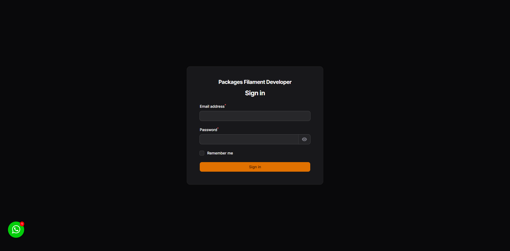
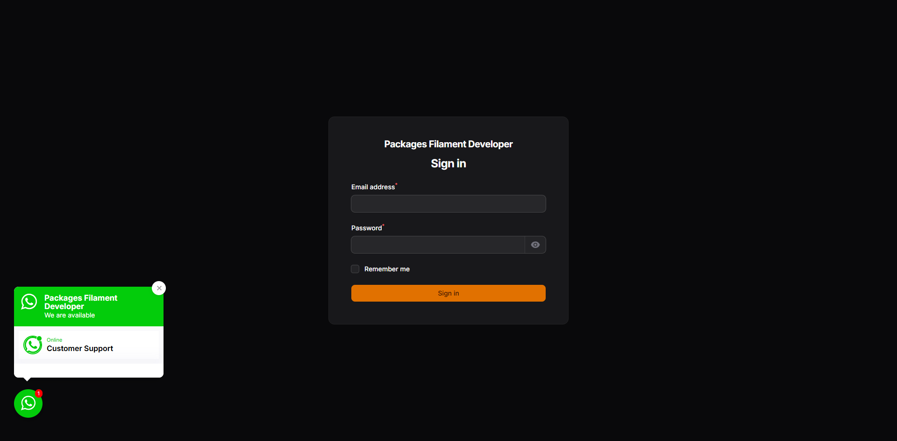
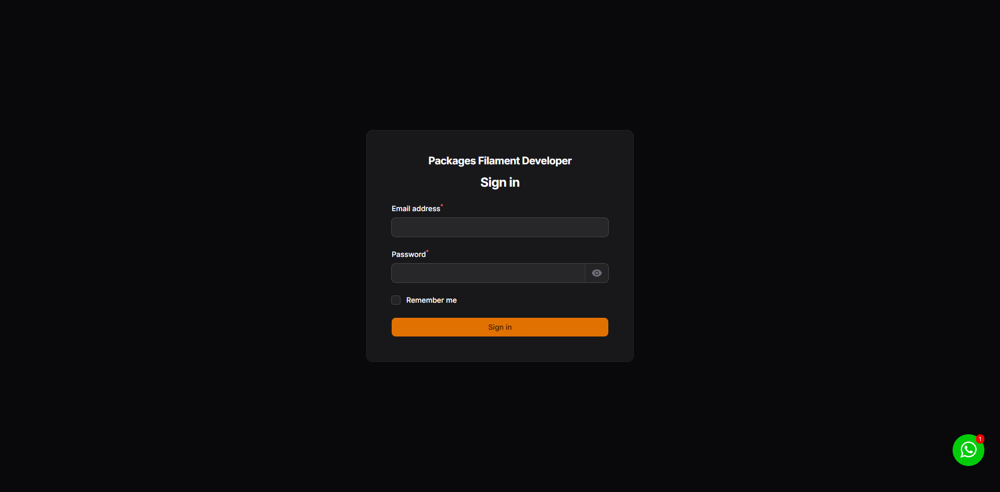
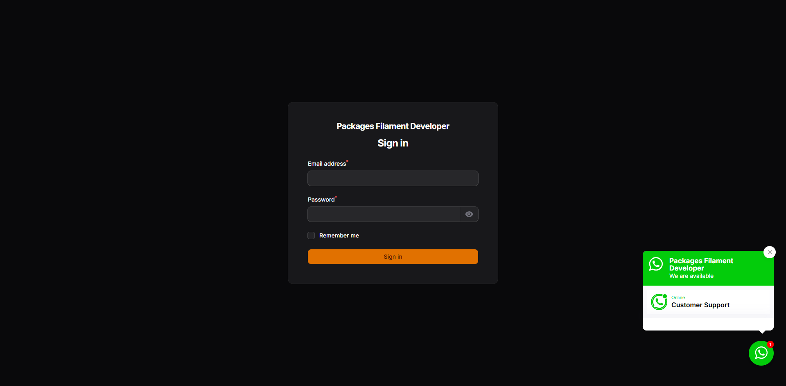
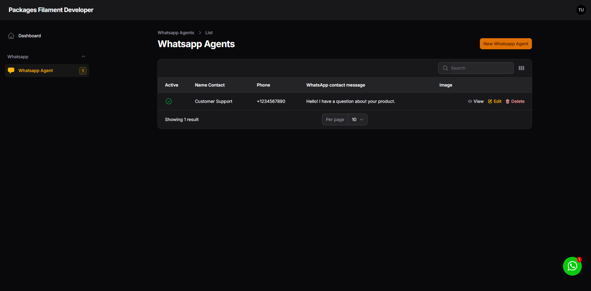
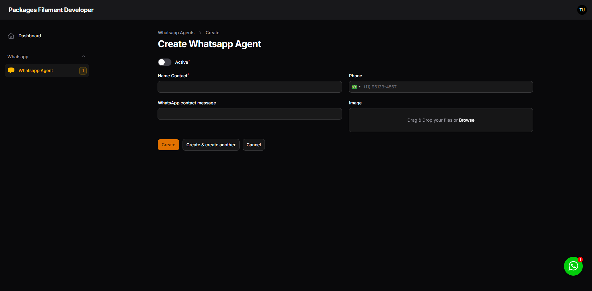
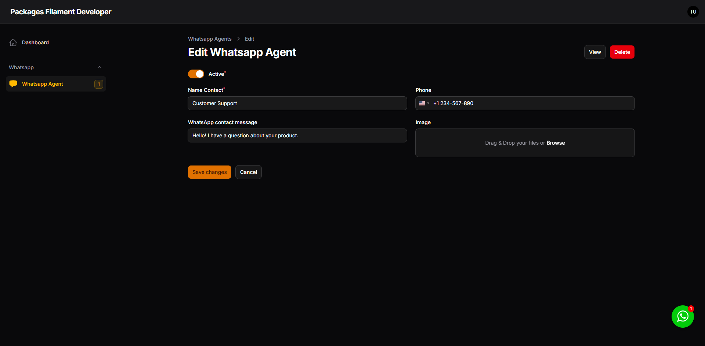

<div class="filament-hidden">


</div>

# Filament Whatsapp Widget

[](https://packagist.org/packages/jeffersongoncalves/filament-whatsapp-widget)
[](https://github.com/jeffersongoncalves/filament-whatsapp-widget/actions?query=workflow%3A"Fix+PHP+code+styling"+branch%3Amaster)
[](https://packagist.org/packages/jeffersongoncalves/filament-whatsapp-widget)

This Filament package provides a simple yet customizable WhatsApp widget for your website. It allows you to easily add a clickable WhatsApp button or floating widget to connect visitors directly with your WhatsApp account. The widget is designed to be easily integrated into your Laravel application and is fully customizable to match your website's design.

## Compatibility

| Package Version                                                                | Filament Version |
|--------------------------------------------------------------------------------|------------------|
| [1.x](https://github.com/jeffersongoncalves/filament-whatsapp-widget/tree/1.x) | 3.x              |
| [2.x](https://github.com/jeffersongoncalves/filament-whatsapp-widget/tree/2.x) | 4.x              |
| [3.x](https://github.com/jeffersongoncalves/filament-whatsapp-widget/tree/3.x) | 5.x              |

## Features

- 🚀 **Multi-agent support**: Add multiple WhatsApp agents with different phone numbers and names
- 🎨 **Customizable appearance**: Change the widget's position, colors, and text
- 🔊 **Audio notifications**: Optional sound alert when the widget loads (configurable)
- 📱 **Mobile-friendly**: Responsive design that works on all devices
- 🌐 **Localization support**: Easily translate the widget to any language
- 🔄 **Pre-defined messages**: Set default text messages for each agent
- 🖼️ **Custom agent avatars**: Add profile pictures for each agent

## Requirements

- PHP 8.2 or higher
- Laravel 11.0 or higher
- Filament 4.0

## Installation

You can install the package via composer:

```bash
composer require jeffersongoncalves/filament-whatsapp-widget:^2.0
```

## Usage

This package is a Filament wrapper for [jeffersongoncalves/laravel-whatsapp-widget](https://github.com/jeffersongoncalves/laravel-whatsapp-widget).

Publish config file.

```bash
php artisan vendor:publish --tag=whatsapp-widget-config
php artisan vendor:publish --tag=filament-whatsapp-widget-config
```

Publish migration file.

```bash
php artisan vendor:publish --tag=whatsapp-widget-migrations
```

Publish assets file.

```bash
php artisan vendor:publish --tag=whatsapp-widget-assets
php artisan vendor:publish --tag=filament-phone-input-assets
```

Add in AdminPanelProvider.php

```php
use JeffersonGoncalves\Filament\WhatsappWidget\WhatsappWidgetPlugin;

->plugins([
    WhatsappWidgetPlugin::make(),
])
```

### Manual Usage (Optional)

If you want to use the widget on non-Filament pages, add the following templates to your layout:

#### Head Template

```php
@include('whatsapp-widget::whatsapp-widget-head')
```

#### Body Template

```php
@include('whatsapp-widget::whatsapp-widget-body')
```

## Configuration

After publishing the configuration file, you can customize the widget by editing the `config/whatsapp-widget.php` file:

```php
return [
    // Enable or disable audio notification
    'audio' => true,

    // Play audio notification once per day or on every page load
    'play_audio_daily' => true,

    // Filesystem disk for storing agent images
    'disk' => env('FILESYSTEM_DISK', 'local'),

    // Application URL (used for redirection)
    'url' => env('APP_URL', 'http://localhost'),

    // Application name (displayed in the widget)
    'name' => env('APP_NAME', 'Laravel App'),

    // WhatsApp API key (if needed)
    'key' => env('WHATSAPP_KEY'),

    // Widget position on the screen (left or right)
    'position' => 'right',
];
```

And `config/filament-whatsapp-widget.php` file:

```php
use JeffersonGoncalves\WhatsappWidget\Models\WhatsappAgent;

return [
    'whatsapp_agent_resource' => [
        'cluster' => null,
        'model' => WhatsappAgent::class,
        'should_register_navigation' => true,
        'navigation_group' => true,
        'navigation_badge' => true,
        'navigation_sort' => -1,
        'navigation_icon' => 'heroicon-s-chat-bubble-left',
        'slug' => 'whatsapp/whatsapp-agent',
    ],
];
```

## Customization

### Translations

This package is translated into several languages:

- Arabic
- Czech
- German
- English
- Spanish
- Persian
- French
- Hebrew
- Indonesian
- Italian
- Japanese
- Dutch
- Polish
- Portuguese
- Portuguese (Brazil)
- Portuguese (Portugal)
- Slovak
- Turkish

You can customize the widget's text by editing the translation files in `resources/lang/vendor/filament-whatsapp-widget/`.

### Position

By default, the widget appears in the bottom-right corner of the page. You can change this by modifying the `position` value in the `config/whatsapp-widget.php` file.

Example for left position:

```php
'position' => 'left',
```

| Default                                                              | Open                                                                                  |
|----------------------------------------------------------------------|---------------------------------------------------------------------------------------|
|  |  |

Example for right position:

```php
'position' => 'right',
```

| Default                                                                | Open                                                                                    |
|------------------------------------------------------------------------|-----------------------------------------------------------------------------------------|
|  |  |

### Redirect Page

When a user clicks on an agent, they are redirected to a temporary page before being sent to WhatsApp. This page can be customized by publishing the package views.


### Filament Resource

You can manage your WhatsApp agents using the Filament resource provided by this package.

| List                                                          | Create                                                           |
|---------------------------------------------------------------|------------------------------------------------------------------|
|  |  |

| Edit                                                         | View                                                         |
|--------------------------------------------------------------|--------------------------------------------------------------|
|  |  |

## Testing

```bash
composer test
```

## Changelog

Please see [CHANGELOG](CHANGELOG.md) for more information on what has changed recently.

## Contributing

Please see [CONTRIBUTING](.github/CONTRIBUTING.md) for details.

## Security Vulnerabilities

Please review [our security policy](../../security/policy) on how to report security vulnerabilities.

## Credits

- [Jèfferson Gonçalves](https://github.com/jeffersongoncalves)
- [All Contributors](../../contributors)

## License

The MIT License (MIT). Please see [License File](LICENSE.md) for more information.
