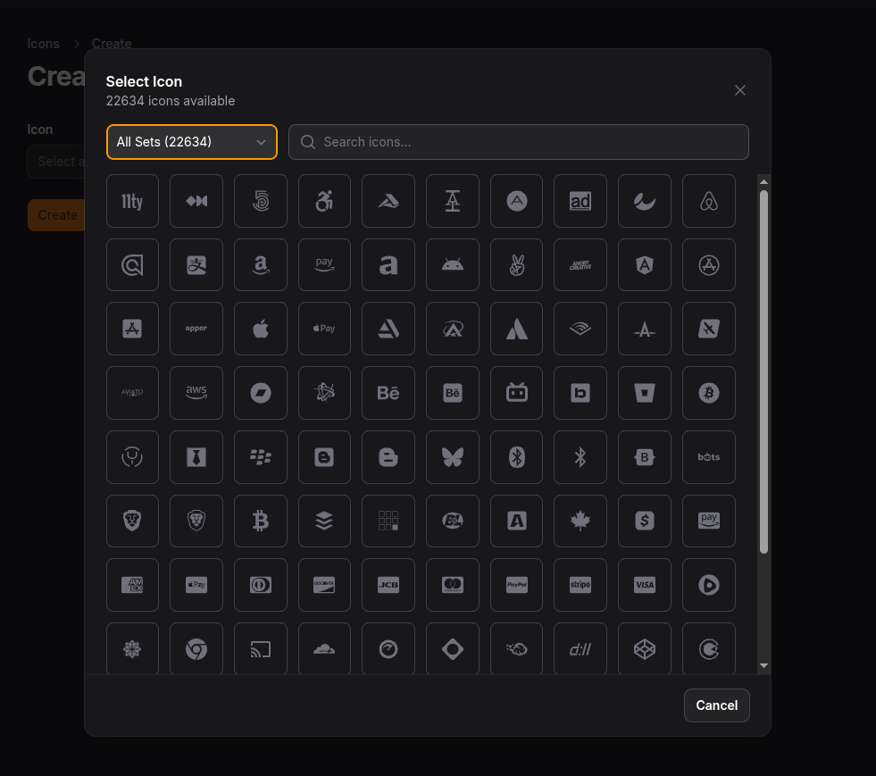
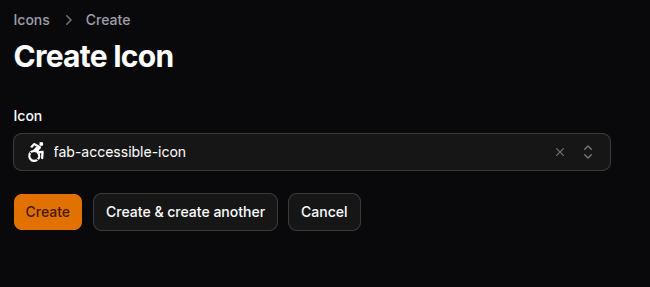
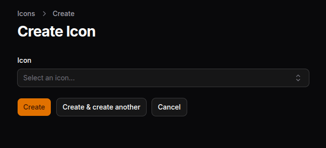

# Filament Icon Picker

[](https://packagist.org/packages/wallacemartinss/filament-icon-picker)
[](https://packagist.org/packages/wallacemartinss/filament-icon-picker)

A beautiful, modern icon picker component for Filament v4, powered by [blade-ui-kit/blade-icons](https://github.com/blade-ui-kit/blade-icons).



## Screenshots

<details>
<summary>📸 Click to view screenshots</summary>

| | |
|:---:|:---:|
|  |  |

</details>

## Features

- 🎨 **Beautiful Modal Interface** - Modern, responsive grid layout with smooth animations
- 🔍 **Smart Search** - Real-time filtering by icon name
- 📦 **Multiple Icon Sets** - Support for all blade-icons packages (Heroicons, FontAwesome, Phosphor, Material, etc.)
- 🎯 **Set Filtering** - Filter icons by their provider using dropdown
- ⚡ **Infinite Scroll** - Performance-optimized with lazy loading
- 🖼️ **Preview** - Shows selected icon in the field
- 📋 **Form Field** - Use in Filament forms
- 📊 **Table Column** - Display icons in tables
- 📝 **Infolist Entry** - Show icons in infolists (read-only)
- ⚙️ **Configurable** - Customize modal size, columns, and available icon sets

## Requirements

- PHP 8.2+
- Laravel 11+
- Filament 4.0+
- blade-ui-kit/blade-icons 1.0+

## Installation

### Step 1: Install the package via Composer

```bash
composer require wallacemartinss/filament-icon-picker
```

### Step 2: Install icon packages (Interactive)

You need at least one icon package to use the Icon Picker. Use the interactive installer:

```bash
php artisan filament-icon-picker:install-icons
```

This will show you an interactive menu to select which icon packages to install:

```
🎨 Filament Icon Picker - Install Icons

? Select icon packages to install:
  ● Heroicons - Heroicons by Tailwind CSS (~1,300 icons)
  ○ Fontawesome - Font Awesome (Solid, Regular, Brands) (~2,800 icons)
  ○ Phosphor - Phosphor Icons (~9,000 icons)
  ○ Material - Google Material Design (~10,000 icons)
  ○ Tabler - Tabler Icons (~4,400 icons)
  ○ Lucide - Lucide Icons (~1,400 icons)
```

**Other options:**

```bash
# List available packages and their status
php artisan filament-icon-picker:install-icons --list

# Install all icon packages at once
php artisan filament-icon-picker:install-icons --all
```

**Or install manually via Composer:**

```bash
# Heroicons (recommended)
composer require blade-ui-kit/blade-heroicons

# Font Awesome (2800+ icons)
composer require owenvoke/blade-fontawesome

# Phosphor Icons (9000+ icons)
composer require codeat3/blade-phosphor-icons

# Google Material Design Icons (10000+ icons)
composer require codeat3/blade-google-material-design-icons

# Tabler Icons (4400+ icons)
composer require blade-ui-kit/blade-tabler-icons

# Lucide Icons (1400+ icons)
composer require mallardduck/blade-lucide-icons
```

See all available icon packages at [Blade Icons](https://blade-ui-kit.com/blade-icons#icon-packages).


### Step 3: Add package views to your Tailwind CSS configuration

Add the plugin's views to your theme CSS file so Tailwind can scan them:

```css
/* resources/css/filament/admin/theme.css */

@source '../../../../vendor/wallacemartinss/filament-icon-picker/resources/views/**/*';
```

### Step 4: Build your assets

```bash
npm run build
```

### Step 5: (Optional) Publish the config file

```bash
php artisan vendor:publish --tag="filament-icon-picker-config"
```

### Step 6: Clear caches

```bash
php artisan optimize:clear
```

### Step 7: (Optional) Cache icons for better performance

```bash
php artisan icons:cache
```

### Icon Enums (Auto-generated)

When you install icon packages using `php artisan filament-icon-picker:install-icons`, **PHP Enums are automatically generated** for type-safe icon usage:

```php
use Wallacemartinss\FilamentIconPicker\Enums\Heroicons;
use Wallacemartinss\FilamentIconPicker\Enums\GoogleMaterialDesignIcons;
use Wallacemartinss\FilamentIconPicker\Enums\PhosphorIcons;

// In navigation icon (with full autocomplete!):
protected static string|BackedEnum|null $navigationIcon = GoogleMaterialDesignIcons::AccountCircle;

// In actions:
Action::make('star')->icon(Heroicons::OutlinedStar)

// In pages:
public static function getNavigationIcon(): ?string
{
    return PhosphorIcons::WhatsappLogoDuotone->value;
}
```

You can also regenerate enums manually:

```bash
php artisan filament-icon-picker:generate-enums --all
```

#### Icon Helper (No Generation Needed)

For dynamic icon usage without generating enums, use the `Icon` helper:

```php
use Wallacemartinss\FilamentIconPicker\Enums\Icon;

// Navigation icon:
public static function getNavigationIcon(): ?string
{
    return Icon::material('account-circle');
}

// With variants:
Icon::heroicon('users', 'outlined')      // heroicon-o-users
Icon::heroicon('users', 'solid')         // heroicon-s-users
Icon::phosphor('whatsapp-logo', 'duotone') // phosphor-whatsapp-logo-duotone
Icon::fontawesome('heart', 'solid')      // fas-heart
Icon::fontawesome('github', 'brands')    // fab-github
```


## Usage

### Form Field

```php
use Wallacemartinss\FilamentIconPicker\Forms\Components\IconPickerField;

public static function form(Form $form): Form
{
    return $form
        ->schema([
            IconPickerField::make('icon')
                ->label('Select an Icon')
                ->searchable()
                ->required(),
        ]);
}
```

#### Restricting Icon Sets

```php
IconPickerField::make('icon')
    ->allowedSets(['heroicons', 'fontawesome-solid', 'phosphor-icons'])
```

#### Custom Modal Size

```php
IconPickerField::make('icon')
    ->modalSize('5xl') // sm, md, lg, xl, 2xl, 3xl, 4xl, 5xl, 6xl, 7xl
```

#### With Placeholder

```php
IconPickerField::make('icon')
    ->placeholder('Choose an icon...')
```

#### Hide Set Filter

```php
IconPickerField::make('icon')
    ->showSetFilter(false)
```

### Table Column

```php
use Wallacemartinss\FilamentIconPicker\Tables\Columns\IconPickerColumn;

public static function table(Table $table): Table
{
    return $table
        ->columns([
            IconPickerColumn::make('icon')
                ->label('Icon'),
        ]);
}
```

#### With Size

```php
IconPickerColumn::make('icon')
    ->size('lg') // xs, sm, md, lg, xl, 2xl

// Or use shortcut methods:
IconPickerColumn::make('icon')->extraSmall()  // xs
IconPickerColumn::make('icon')->small()       // sm
IconPickerColumn::make('icon')->medium()      // md (default)
IconPickerColumn::make('icon')->large()       // lg
IconPickerColumn::make('icon')->extraLarge()  // xl
```

#### With Color

```php
IconPickerColumn::make('icon')
    ->color('success') // primary, secondary, success, warning, danger, info

// Or use shortcut methods:
IconPickerColumn::make('icon')->primary()
IconPickerColumn::make('icon')->success()
IconPickerColumn::make('icon')->warning()
IconPickerColumn::make('icon')->danger()
IconPickerColumn::make('icon')->info()

// Or use CSS color values:
IconPickerColumn::make('icon')->color('#ff5500')
IconPickerColumn::make('icon')->color('rgb(255, 85, 0)')
IconPickerColumn::make('icon')->color('purple')

// Or use custom Tailwind classes:
IconPickerColumn::make('icon')->color('text-purple-500')
```

#### Dynamic Color (Based on Record)

```php
IconPickerColumn::make('icon')
    ->color(fn ($record) => match($record->status) {
        'active' => 'success',
        'pending' => 'warning',
        'inactive' => 'danger',
        default => 'gray',
    })
```

#### With Animation

```php
IconPickerColumn::make('icon')
    ->animation('spin') // spin, pulse

// Or use shortcut methods:
IconPickerColumn::make('icon')->spin()    // Rotation animation
IconPickerColumn::make('icon')->pulse()   // Pulsing/fading animation

// With custom speed (CSS duration format):
IconPickerColumn::make('icon')->spin('0.5s')   // Fast spin
IconPickerColumn::make('icon')->spin('3s')    // Slow spin
IconPickerColumn::make('icon')->pulse('0.5s') // Fast pulse
IconPickerColumn::make('icon')->pulse('4s')   // Slow pulse

// Or set speed separately:
IconPickerColumn::make('icon')
    ->spin()
    ->animationSpeed('0.3s')
```

#### Show Icon Name

```php
IconPickerColumn::make('icon')
    ->showLabel() // Shows the icon name next to the icon
```

#### Fixed Icon (Without Database)

Use the `icon()` method to display a fixed icon without requiring a database column:

```php
// Static icon
IconPickerColumn::make('type_indicator')
    ->icon('heroicon-o-star')
    ->warning()
    ->large()

// Dynamic icon based on record
IconPickerColumn::make('status_indicator')
    ->icon(fn ($record) => $record->is_premium ? 'heroicon-s-star' : 'heroicon-o-user')
    ->color(fn ($record) => $record->is_premium ? 'warning' : 'gray')
    ->animation(fn ($record) => $record->is_featured ? 'pulse' : null)
```

#### Combining Options

```php
IconPickerColumn::make('icon')
    ->large()
    ->success()
    ->spin()
    ->showLabel()

// Dynamic example with all features:
IconPickerColumn::make('status_icon')
    ->color(fn ($record) => $record->is_active ? 'success' : 'danger')
    ->animation(fn ($record) => $record->is_processing ? 'spin' : null)
    ->size('lg')
```

### Infolist Entry

```php
use Wallacemartinss\FilamentIconPicker\Infolists\Components\IconPickerEntry;

public static function infolist(Infolist $infolist): Infolist
{
    return $infolist
        ->schema([
            IconPickerEntry::make('icon')
                ->label('Icon'),
        ]);
}
```

#### With Size and Color

```php
IconPickerEntry::make('icon')
    ->size('xl')
    ->color('primary')

// Or use shortcut methods:
IconPickerEntry::make('icon')
    ->extraLarge()
    ->danger()
```

#### Dynamic Color (Based on Record)

```php
IconPickerEntry::make('icon')
    ->color(fn ($record) => match($record->status) {
        'active' => 'success',
        'pending' => 'warning',
        'inactive' => 'danger',
        default => 'gray',
    })
```

#### With Animation

```php
IconPickerEntry::make('icon')
    ->spin()    // Rotation animation
    ->pulse()   // Pulsing/fading animation

// With custom speed (CSS duration format):
IconPickerEntry::make('icon')->spin('0.5s')   // Fast spin
IconPickerEntry::make('icon')->spin('3s')    // Slow spin
IconPickerEntry::make('icon')->pulse('0.5s') // Fast pulse
IconPickerEntry::make('icon')->pulse('4s')   // Slow pulse

// Or set speed separately:
IconPickerEntry::make('icon')
    ->pulse()
    ->animationSpeed('1s')
```

#### Hide Icon Name

```php
IconPickerEntry::make('icon')
    ->showIconName(false) // Hides the icon name, shows only the icon
```

#### Fixed Icon (Without Database)

Use the `icon()` method to display a fixed icon without requiring a database column:

```php
// Static icon
IconPickerEntry::make('badge_icon')
    ->icon('heroicon-o-badge-check')
    ->success()
    ->large()
    ->showIconName(false)

// Dynamic icon based on record
IconPickerEntry::make('user_type')
    ->icon(fn ($record) => $record->is_admin ? 'heroicon-s-shield-check' : 'heroicon-o-user')
    ->color(fn ($record) => $record->is_admin ? 'danger' : 'primary')
```

#### Combining All Features

```php
IconPickerEntry::make('status_icon')
    ->extraLarge()
    ->color(fn ($record) => $record->is_active ? 'success' : 'danger')
    ->animation(fn ($record) => $record->is_loading ? 'spin' : null)
    ->showIconName(false)
```
```

### Using Icon Enums

After generating enums with `php artisan filament-icon-picker:generate-enums`, you can use them anywhere in Filament:

#### Navigation Icons

```php
use Wallacemartinss\FilamentIconPicker\Enums\Heroicons;
use Wallacemartinss\FilamentIconPicker\Enums\GoogleMaterialDesignIcons;

class UserResource extends Resource
{
    protected static string|BackedEnum|null $navigationIcon = GoogleMaterialDesignIcons::AccountCircle;
}
```

#### Dynamic Navigation Icon

```php
use Wallacemartinss\FilamentIconPicker\Enums\PhosphorIcons;
use Wallacemartinss\FilamentIconPicker\Enums\Icon;

// Using generated enum:
public static function getNavigationIcon(): ?string
{
    return PhosphorIcons::WhatsappLogoDuotone->value;
}

// Or using Icon helper (no generation needed):
public static function getNavigationIcon(): ?string
{
    return Icon::phosphor('whatsapp-logo', 'duotone');
}
```

#### Actions

```php
use Wallacemartinss\FilamentIconPicker\Enums\Heroicons;

Action::make('edit')
    ->icon(Heroicons::OutlinedPencil)

Action::make('delete')
    ->icon(Heroicons::OutlinedTrash)
```

#### Enum Methods

Each generated enum includes helpful methods:

```php
use Wallacemartinss\FilamentIconPicker\Enums\Heroicons;

// Get icon value
Heroicons::OutlinedStar->value; // 'heroicon-o-star'

// Get all options (useful for selects)
Heroicons::options(); // ['OutlinedStar' => 'heroicon-o-star', ...]

// Search icons
Heroicons::search('star'); // Returns matching cases

// Works with Filament's ScalableIcon interface
Heroicons::OutlinedStar->getIconForSize(IconSize::Medium);
```

## Configuration

The config file allows you to customize the picker behavior:

```php
// config/filament-icon-picker.php

return [
    /*
    |--------------------------------------------------------------------------
    | Allowed Icon Sets
    |--------------------------------------------------------------------------
    |
    | Define which icon sets should be available in the picker.
    | Leave empty array [] to allow all installed blade-icon sets.
    |
    | Important: Use the exact set name, not the package name!
    | Examples:
    |   - 'heroicons' (from blade-heroicons)
    |   - 'fontawesome-solid', 'fontawesome-regular', 'fontawesome-brands' (from blade-fontawesome)
    |   - 'phosphor-icons' (from blade-phosphor-icons)
    |   - 'google-material-design-icons' (from blade-google-material-design-icons)
    |
    */
    'allowed_sets' => [],

    /*
    |--------------------------------------------------------------------------
    | Icons Per Page
    |--------------------------------------------------------------------------
    |
    | Number of icons to load initially and on each scroll batch.
    | Increase for faster browsing, decrease for better performance.
    |
    */
    'icons_per_page' => 100,

    /*
    |--------------------------------------------------------------------------
    | Column Layout
    |--------------------------------------------------------------------------
    |
    | Number of columns in the icon grid for different screen sizes.
    |
    */
    'columns' => [
        'default' => 5,
        'sm' => 7,
        'md' => 9,
        'lg' => 10,
    ],

    /*
    |--------------------------------------------------------------------------
    | Modal Size
    |--------------------------------------------------------------------------
    |
    | The size of the icon picker modal.
    | Options: 'sm', 'md', 'lg', 'xl', '2xl', '3xl', '4xl', '5xl', '6xl', '7xl'
    |
    */
    'modal_size' => '4xl',

    /*
    |--------------------------------------------------------------------------
    | Cache Icons
    |--------------------------------------------------------------------------
    |
    | Whether to cache the icon list for better performance.
    | Set to false during development if you're adding new icons frequently.
    |
    */
    'cache_icons' => true,

    /*
    |--------------------------------------------------------------------------
    | Cache Duration
    |--------------------------------------------------------------------------
    |
    | How long to cache the icon list (in seconds).
    | Default: 86400 (24 hours)
    |
    */
    'cache_duration' => 86400,
];
```

## Finding Icon Set Names

To find the correct set names for your installed packages, run:

```bash
php artisan tinker
```

Then:

```php
use Wallacemartinss\FilamentIconPicker\IconSetManager;
$manager = new IconSetManager();
print_r($manager->getSetNames());
```

This will output all available set names like:

```
Array
(
    [0] => heroicons
    [1] => fontawesome-solid
    [2] => fontawesome-regular
    [3] => fontawesome-brands
    [4] => phosphor-icons
    [5] => google-material-design-icons
)
```

## Troubleshooting

### Icons not showing in the modal

1. Make sure you have at least one blade-icons package installed
2. Check that the set names in your config are correct (run the tinker command above)
3. Clear caches: `php artisan optimize:clear`

### Modal styling looks broken

1. Make sure you added the `@source` directive to your theme CSS
2. Rebuild assets: `npm run build`
3. Clear view cache: `php artisan view:clear`

### Infinite scroll not working

1. Clear browser cache with `Ctrl+Shift+R`
2. Check browser console for JavaScript errors

## Testing

To run the package tests:

```bash
cd packages/wallacemartinss/filament-icon-picker
./vendor/bin/phpunit
```

Or with testdox output:

```bash
./vendor/bin/phpunit --testdox
```

## Changelog

Please see [CHANGELOG](CHANGELOG.md) for more information on what has changed recently.

## Contributing

Please see [CONTRIBUTING](CONTRIBUTING.md) for details.

## Security Vulnerabilities

Please review [our security policy](../../security/policy) on how to report security vulnerabilities.

## Credits

- [Wallace Martins](https://github.com/wallacemartinss)
- [All Contributors](../../contributors)

## License

The MIT License (MIT). Please see [License File](LICENSE.md) for more information.
