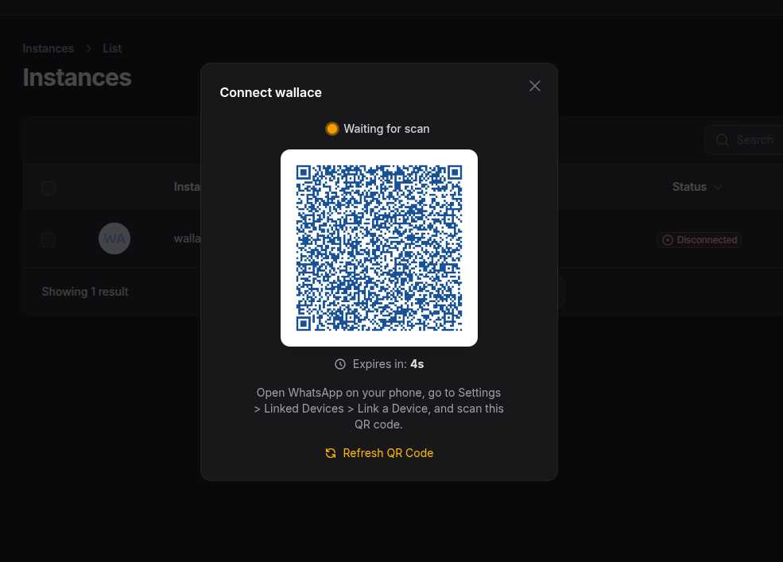
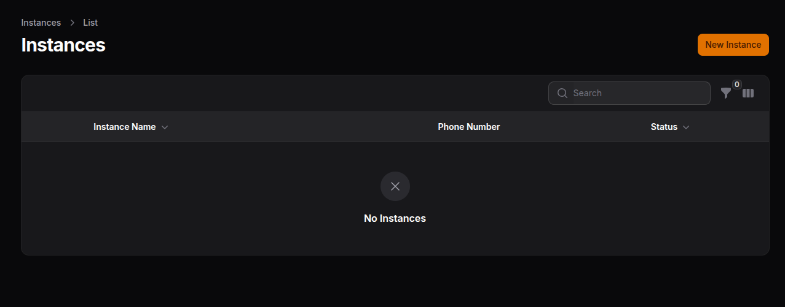
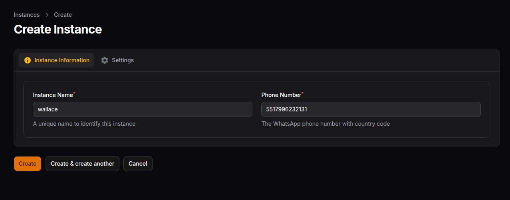
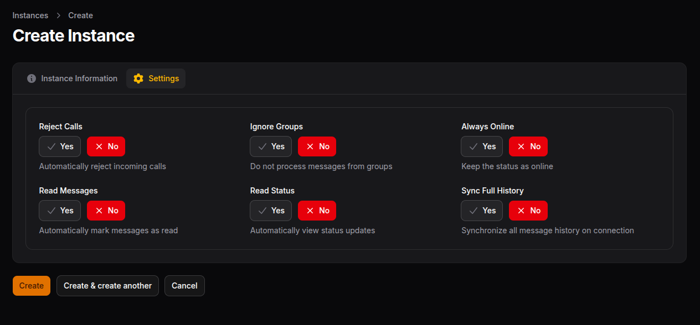
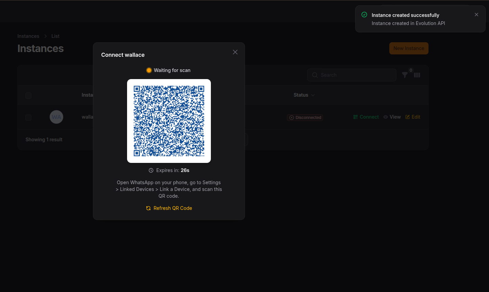
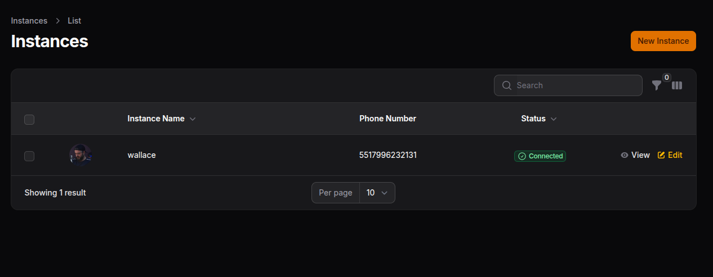
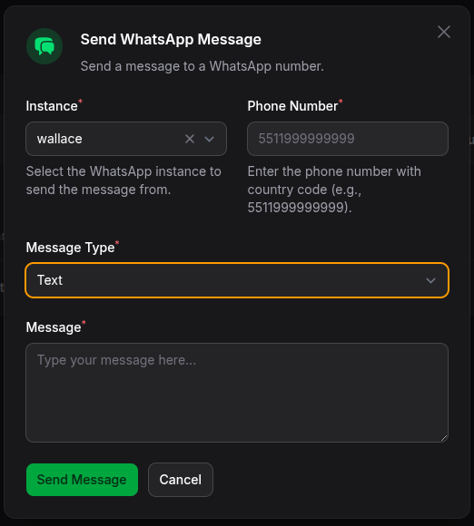
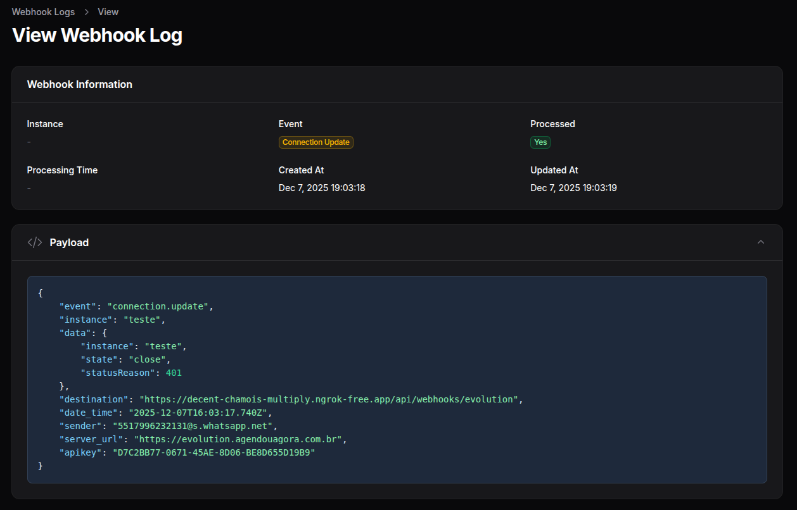
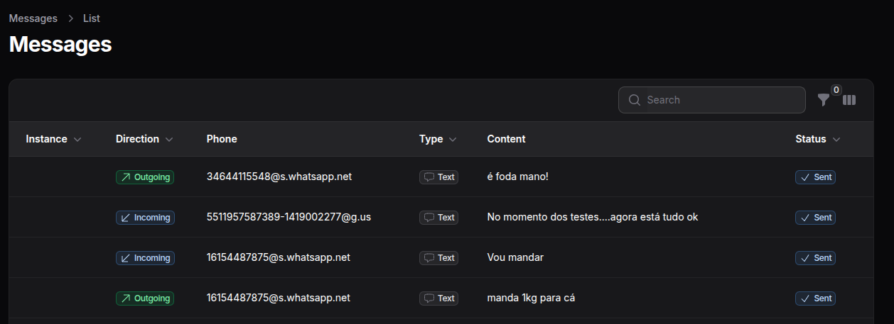

# Filament Evolution - WhatsApp Connector

[](https://packagist.org/packages/wallacemartinss/filament-whatsapp-conector)
[](https://packagist.org/packages/wallacemartinss/filament-whatsapp-conector)

A Filament v4 plugin for WhatsApp integration using [Evolution API v2](https://doc.evolution-api.com/).



## Features

- 🔌 **Easy Integration** - Connect your WhatsApp with Evolution API v2
- 🏢 **Multi-Tenancy** - Full support for Filament's native multi-tenancy
- 📱 **QR Code Connection** - Real-time QR code display with countdown timer
- 📨 **Webhook Support** - Receive events from Evolution API (messages, connection updates, etc.)
- 💬 **Message Sending** - Send text, images, videos, audio, documents and more
- 🎯 **Filament Action** - Ready-to-use action for sending messages from anywhere
- 🔧 **Service Trait** - Easily integrate message sending into your own services
- 🔐 **Secure** - Credentials stored in config/env, never in database
- 🎨 **Filament v4 Native** - Beautiful UI with Filament components
- 🌍 **Translations** - Full i18n support (English and Portuguese included)
- ⚡ **Real-time** - Livewire-powered components with Alpine.js

## Screenshots

<details>
<summary>📸 Click to view screenshots</summary>

| | |
|:---:|:---:|
|  |  |
|  |  |
|  |  |
|  |  |

</details>

## Requirements

- PHP 8.2+
- Laravel 11.x or 12.x
- Filament v4
- Evolution API v2 instance

---

## Installation

### Step 1: Install via Composer

```bash
composer require wallacemartinss/filament-whatsapp-conector
```

### Step 2: Publish Configuration

```bash
php artisan vendor:publish --tag="filament-evolution-config"
```

### Step 3: Run Migrations

```bash
php artisan vendor:publish --tag="filament-evolution-migrations"
php artisan migrate
```

### Step 4: Register the Plugin

Add the plugin to your Filament Panel Provider:

```php
use WallaceMartinss\FilamentEvolution\FilamentEvolutionPlugin;

public function panel(Panel $panel): Panel
{
    return $panel
        ->plugins([
            FilamentEvolutionPlugin::make(),
        ]);
}
```

### Step 5: Configure Tailwind CSS

Add the plugin's views and source files to your Filament theme CSS file (e.g., `resources/css/filament/admin/theme.css`):

```css
@import '../../../../vendor/filament/filament/resources/css/theme.css';

@source '../../../../app/Filament/**/*';
@source '../../../../resources/views/filament/**/*';

/* Add these lines for Filament Evolution */
@source '../../../../vendor/wallacemartinss/filament-evolution/resources/views/**/*';
@source '../../../../vendor/wallacemartinss/filament-evolution/src/**/*';
```

Then rebuild your assets:

```bash
npm run build
```

### Plugin Options

You can customize which resources are available in the panel:

```php
FilamentEvolutionPlugin::make()
    ->viewMessageHistory()    // Enable message history resource
    ->viewWebhookLogs()       // Enable webhook logs resource
```

| Method | Default | Description |
|--------|---------|-------------|
| `whatsappInstanceResource(bool)` | `true` | Show/hide the WhatsApp Instances resource |
| `viewMessageHistory(bool)` | `false` | Show/hide the Message History resource |
| `viewWebhookLogs(bool)` | `false` | Show/hide the Webhook Logs resource |

#### Example: Full Configuration

```php
FilamentEvolutionPlugin::make()
    ->whatsappInstanceResource()  // Show instances (default: true)
    ->viewMessageHistory()        // Show message history
    ->viewWebhookLogs()           // Show webhook logs
```

---

## Configuration

### Environment Variables (.env)

Only API credentials should be in your `.env` file:

```env
# Evolution API Connection (Required)
EVOLUTION_URL=https://your-evolution-api.com
EVOLUTION_API_KEY=your_api_key

# Webhook URL (Required for receiving events)
EVOLUTION_WEBHOOK_URL=https://your-app.com/api/evolution/webhook

# Webhook Secret (Optional - for security)
EVOLUTION_WEBHOOK_SECRET=your_secret_key

# Default Instance (Optional - for single instance setups)
EVOLUTION_DEFAULT_INSTANCE=your_instance_id
```

### Step 6: Start the Queue Worker

The plugin uses Laravel queues to process webhooks and send messages. Make sure you have a queue worker running:

```bash
php artisan queue:work
```

For production, use a process manager like Supervisor to keep the worker running. See the [Laravel Queue Documentation](https://laravel.com/docs/queues#supervisor-configuration) for more details.

### Config File

All other settings are in `config/filament-evolution.php`. Publish and customize:

```bash
php artisan vendor:publish --tag="filament-evolution-config"
```

Key configuration options:

```php
// config/filament-evolution.php

return [
    // Queue settings
    'queue' => [
        'enabled' => true,
        'connection' => null,  // null = default connection
        'name' => 'default',   // queue name
    ],

    // Storage settings
    'storage' => [
        'webhooks' => true,    // save webhooks to database
        'messages' => true,    // save messages to database
    ],

    // Cleanup policy (automatic deletion of old records)
    'cleanup' => [
        'webhooks_days' => 30, // delete webhooks older than 30 days
        'messages_days' => 90, // delete messages older than 90 days
    ],

    // Instance defaults
    'instance' => [
        'reject_call' => false,
        'always_online' => false,
        // ...
    ],

    // Multi-tenancy
    'tenancy' => [
        'enabled' => false,
        'column' => 'team_id',
        'table' => 'teams',
        'model' => 'App\\Models\\Team',
    ],
];
```

---

## Cleanup Command

The plugin includes a cleanup command to remove old records:

```bash
# Run cleanup with config settings
php artisan evolution:cleanup

# Preview what would be deleted (dry run)
php artisan evolution:cleanup --dry-run

# Override config settings
php artisan evolution:cleanup --webhooks-days=7 --messages-days=30
```

### Scheduling Cleanup

Add to your `routes/console.php`:

```php
use Illuminate\Support\Facades\Schedule;

Schedule::command('evolution:cleanup')->daily();
```

---

## Instance Management

### Creating an Instance

1. Navigate to **WhatsApp > Instances**
2. Click **New Instance**
3. Fill in the instance name and phone number
4. Configure settings (reject calls, always online, etc.)
5. Click **Save** - the QR Code modal will open automatically
6. Scan the QR Code with your WhatsApp

### Instance Settings

| Setting | Description |
|---------|-------------|
| **Reject Calls** | Automatically reject incoming calls |
| **Message on Call** | Message sent when rejecting calls |
| **Ignore Groups** | Don't process messages from groups |
| **Always Online** | Keep WhatsApp status as online |
| **Read Messages** | Automatically mark messages as read |
| **Read Status** | Automatically view status updates |
| **Sync Full History** | Sync all message history on connection |

---

## Sending Messages

The plugin provides three ways to send WhatsApp messages:

1. **Filament Action** - For UI-based sending in tables, pages and widgets
2. **Whatsapp Facade** - For quick message sending anywhere
3. **CanSendWhatsappMessage Trait** - For integration into your services

### 1. Using the Filament Action

The `SendWhatsappMessageAction` can be used in any Filament page, resource, or widget.

#### Basic Usage

```php
use WallaceMartinss\FilamentEvolution\Actions\SendWhatsappMessageAction;

// In a table
public function table(Table $table): Table
{
    return $table
        ->actions([
            SendWhatsappMessageAction::make(),
        ]);
}

// In a page header
protected function getHeaderActions(): array
{
    return [
        SendWhatsappMessageAction::make(),
    ];
}
```

#### Pre-filling Values

```php
SendWhatsappMessageAction::make()
    ->number('5511999999999')              // Default phone number
    ->instance($instanceId)                 // Default instance
    ->message('Hello World!')               // Default message
```

#### Using with Table Records

Get the phone number automatically from the record:

```php
// Using attribute name
SendWhatsappMessageAction::make()
    ->numberFrom('phone'),

// Using dot notation for relationships
SendWhatsappMessageAction::make()
    ->numberFrom('contact.phone'),

// Using closure for custom logic
SendWhatsappMessageAction::make()
    ->numberFrom(fn ($record) => $record->celular ?? $record->telefone),

// Also set instance from record
SendWhatsappMessageAction::make()
    ->numberFrom('phone')
    ->instanceFrom('whatsapp_instance_id'),
```

#### Hiding Form Fields

```php
SendWhatsappMessageAction::make()
    ->hideInstanceSelect()     // Hide instance selector
    ->hideNumberInput()        // Hide phone number input
    ->textOnly()               // Only allow text messages (hide file upload)
```

#### Limiting Message Types

```php
use WallaceMartinss\FilamentEvolution\Enums\MessageTypeEnum;

SendWhatsappMessageAction::make()
    ->allowedTypes([
        MessageTypeEnum::TEXT,
        MessageTypeEnum::IMAGE,
    ]);
```

#### Custom Storage Disk

```php
SendWhatsappMessageAction::make()
    ->disk('s3')   // Use S3 for file uploads
```

---

### 2. Using the Whatsapp Facade

For programmatic message sending from anywhere in your application:

```php
use WallaceMartinss\FilamentEvolution\Facades\Whatsapp;

// Send text
Whatsapp::sendText($instanceId, '5511999999999', 'Hello!');

// Send image with caption
Whatsapp::sendImage($instanceId, '5511999999999', 'path/to/image.jpg', 'Check this out!');

// Send video with caption
Whatsapp::sendVideo($instanceId, '5511999999999', 'path/to/video.mp4', 'Watch this!');

// Send audio
Whatsapp::sendAudio($instanceId, '5511999999999', 'path/to/audio.mp3');

// Send document
Whatsapp::sendDocument($instanceId, '5511999999999', 'path/to/file.pdf', 'report.pdf', 'Monthly Report');

// Send location
Whatsapp::sendLocation($instanceId, '5511999999999', -23.5505, -46.6333, 'My Office', 'São Paulo, SP');

// Send contact card
Whatsapp::sendContact($instanceId, '5511999999999', 'John Doe', '+5511888888888');

// Generic send method
Whatsapp::send($instanceId, '5511999999999', 'text', 'Hello World!');
Whatsapp::send($instanceId, '5511999999999', 'image', 'path/to/image.jpg', ['caption' => 'Nice!']);
```

---

### 3. Using the Trait in Your Services

Add the `CanSendWhatsappMessage` trait to integrate message sending into your business logic:

```php
use WallaceMartinss\FilamentEvolution\Concerns\CanSendWhatsappMessage;

class InvoiceService
{
    use CanSendWhatsappMessage;

    public function sendPaymentReminder(Invoice $invoice): void
    {
        $this->sendWhatsappText(
            $invoice->customer->phone,
            "Hello {$invoice->customer->name}, your invoice #{$invoice->number} is due on {$invoice->due_date->format('d/m/Y')}."
        );
    }

    public function sendInvoicePdf(Invoice $invoice): void
    {
        $this->sendWhatsappDocument(
            $invoice->customer->phone,
            $invoice->pdf_path,
            "invoice-{$invoice->number}.pdf",
            "Your invoice is ready!"
        );
    }

    public function sendPromoImage(Customer $customer, string $imagePath): void
    {
        $this->sendWhatsappImage(
            $customer->phone,
            $imagePath,
            "Special promotion just for you! 🎉"
        );
    }
}
```

#### Available Trait Methods

| Method | Description |
|--------|-------------|
| `sendWhatsappText($number, $message)` | Send text message |
| `sendWhatsappImage($number, $path, $caption)` | Send image |
| `sendWhatsappVideo($number, $path, $caption)` | Send video |
| `sendWhatsappAudio($number, $path)` | Send audio |
| `sendWhatsappDocument($number, $path, $fileName, $caption)` | Send document |
| `sendWhatsappLocation($number, $lat, $lng, $name, $address)` | Send location |
| `sendWhatsappContact($number, $contactName, $contactNumber)` | Send contact card |
| `sendWhatsappMessage($number, $type, $content, $options)` | Generic send method |
| `hasWhatsappInstance()` | Check if an instance is available |
| `getConnectedWhatsappInstances()` | Get all connected instances |

#### Customizing the Instance Selection

Override `getWhatsappInstanceId()` to use a specific instance:

```php
class TenantInvoiceService
{
    use CanSendWhatsappMessage;

    protected function getWhatsappInstanceId(): ?string
    {
        // Use tenant's specific WhatsApp instance
        return auth()->user()->tenant->whatsapp_instance_id;
    }
}
```

---

## Storage Support

The plugin supports both local and cloud storage (S3, etc.) for media files.

### Configuration

```env
EVOLUTION_MEDIA_DISK=public
EVOLUTION_MEDIA_DIRECTORY=whatsapp-media
EVOLUTION_MEDIA_MAX_SIZE=16384
```

### Using Different Disks

```php
// Using the Facade with S3
Whatsapp::sendDocument($instanceId, $number, 'documents/report.pdf', 'report.pdf', null, 's3');

// Using the Action with custom disk
SendWhatsappMessageAction::make()->disk('s3');
```

---

## Webhooks

The plugin includes a webhook endpoint to receive events from Evolution API.

### Available Events

| Event | Description |
|-------|-------------|
| `APPLICATION_STARTUP` | API started |
| `QRCODE_UPDATED` | New QR code generated |
| `CONNECTION_UPDATE` | Connection status changed |
| `NEW_TOKEN` | New authentication token |
| `SEND_MESSAGE` | Message sent |
| `PRESENCE_UPDATE` | Contact online/offline |
| `MESSAGES_UPSERT` | New message received |

### Webhook URL

Configure this URL in your Evolution API:

```
https://your-app.com/api/webhooks/evolution
```

---

## Multi-Tenancy

The plugin supports Filament's native multi-tenancy. When enabled:

- All tables include the tenant foreign key
- Models automatically scope queries by tenant
- Records are auto-assigned to current tenant on creation

### Configuration

Edit the `config/filament-evolution.php` file:

```php
'tenancy' => [
    'enabled' => true,
    'column' => 'team_id',
    'table' => 'teams',
    'model' => 'App\\Models\\Team',
    'column_type' => 'uuid', // 'uuid' or 'id'
],
```

---

## Using the Evolution Client Directly

For advanced use cases, you can use the Evolution client directly:

```php
use WallaceMartinss\FilamentEvolution\Services\EvolutionClient;

$client = app(EvolutionClient::class);

// Create instance
$response = $client->createInstance('my-instance', '5511999999999', true, [
    'reject_call' => true,
    'always_online' => true,
]);

// Get connection state
$state = $client->getConnectionState('my-instance');

// Send text message
$client->sendText('my-instance', '5511999999999', 'Hello World!');

// Send image (path is base64 encoded by the service)
$client->sendImage('my-instance', '5511999999999', $base64Content, 'image.jpg', 'Check this!');
```

---

## Testing

```bash
composer test
```

---

## Changelog

Please see [CHANGELOG](CHANGELOG.md) for more information on what has changed recently.

## Contributing

Please see [CONTRIBUTING](CONTRIBUTING.md) for details.

## Security Vulnerabilities

Please review [our security policy](../../security/policy) on how to report security vulnerabilities.

## Credits

- [Wallace Martins](https://github.com/wallacemartinss)
- [All Contributors](../../contributors)

## License

The MIT License (MIT). Please see [License File](LICENSE.md) for more information.
